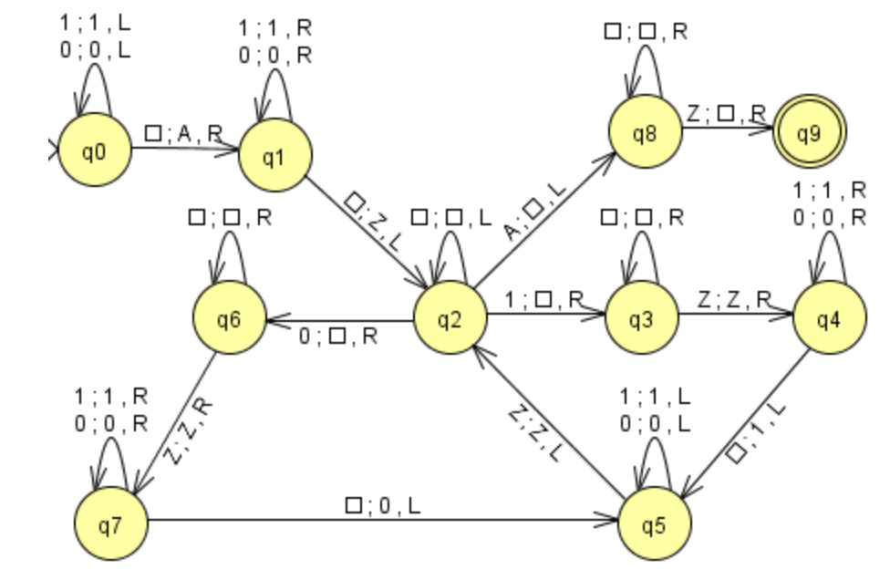

# Problema

Diseñar una Máquina de Turing que, dada una palabra del alfabeto Σ={0, 1}, proporcione su reverso.

## Definición de la Máquina de Turing

Una **Máquina de Turing (MT)** se define como una septupla: M = (Q, Σ, Τ, δ, q₀, B, F)

donde:

- **Q**: Conjunto finito de estados. 
- **Σ**: Alfabeto de entrada
- **Τ**: Conjunto de símbolos de la cinta. El alfabeto `Σ` es un subconjunto de `Τ`.
- **q₀**: Estado inicial de la máquina.
- **B**: Símbolo en blanco. Es un elemento de `Τ` (frecuentemente no está en `Σ`) y representa las celdas vacías de la cinta.
- **F**: Conjunto de estados de aceptación o finales.
- **δ**: Función de transición.

La función de transición se expresa como:
                δ(q, X) = (p, Y, D)

Esto significa:

- Si la máquina está en el estado `q` y la cabeza de lectura está sobre el símbolo `X`,
- Entonces la máquina:
  - Escribe `Y` en la cinta (reemplazando `X`),
  - Mueve la cabeza una posición en la dirección `D` (donde `D ∈ {L, R}`: izquierda o derecha),
  - Y cambia al estado `p`.

---------
## Funcionamiento

La cinta de una Máquina de Turing está formada por **infinitas casillas** hacia la izquierda y hacia la derecha.

- Inicialmente, la palabra de entrada (formada por símbolos del alfabeto `Σ`) está escrita en casillas consecutivas de la cinta.
- La cabeza de lectura/escritura comienza apuntando al **primer símbolo** de la palabra.
- Todas las demás casillas de la cinta contienen el **símbolo en blanco `B`**.

---------
## Estados

En esta maquina se usan los símbolos adicionales A y Z para indicar el comienzo y el final de la palabra en la cinta.

| Estado | Descripción |
|--------|-------------|
| `q0`   | Se desplaza hacia la izquierda hasta encontrar un blanco, que se reemplaza por `A` (inicio de palabra). |
| `q1`   | Se mueve hacia la derecha hasta encontrar el primer blanco a la derecha del último símbolo. Lo reemplaza por `Z` (fin de palabra). |
| `q2`   | Se mueve hacia la izquierda hasta encontrar el primer símbolo válido (`0` o `1`), lo borra (reemplaza con `B`), y según el símbolo, transiciona a `q3` (para `1`) o `q6` (para `0`). |
| `q3`   | Avanza hacia la derecha buscando `Z`. |
| `q4`   | Escribe `1` justo después de `Z`, y transiciona a `q5`. |
| `q5`   | Regresa hacia la izquierda hasta encontrar `Z` para volver a `q2`. |
| `q6`   | Avanza hacia la derecha buscando `Z`. |
| `q7`   | Escribe `0` justo después de `Z`, y transiciona a `q5`. |
| `q8`   | Cuando no quedan más símbolos, limpia `Z` y va al estado final. |
| `q9`   | Estado final (aceptación). |

## Diagrama Maquina de Turing

